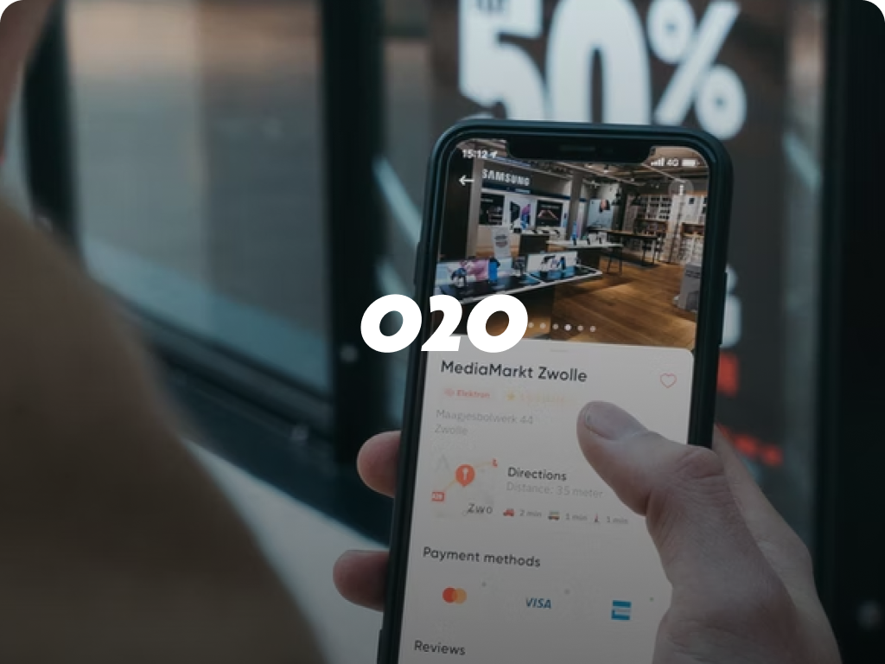
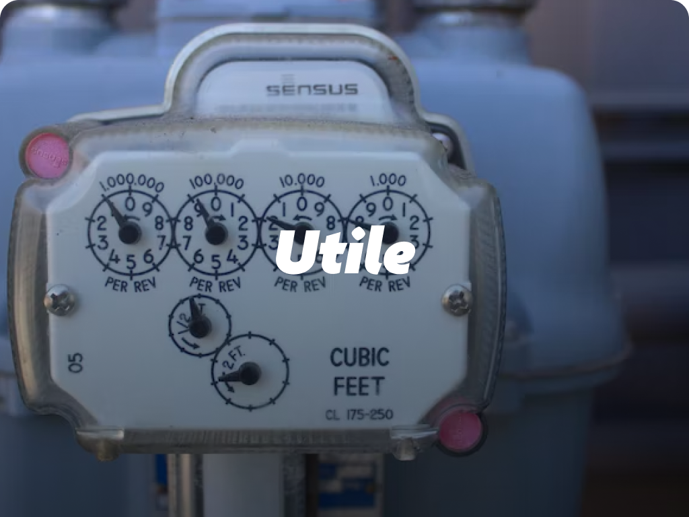

# EXIT Recovery

<p align="center">
  
</p>

> 2022년 팀 프로젝트 EXIT의 프론트엔드를 Next.js 15 환경에서 복구·재구성하는 개인 프로젝트

기존 Next.js 12 Pages Router 구조를 App Router 기반으로 전환하고 있습니다.
중단된 백엔드 의존성 대신 mock 데이터를 사용해 주요 화면과 사용자 흐름부터 단계적으로 복구하고 있습니다.

## 현재 복구 UI 미리보기

현재 저장소에는 페이지 전체 스크린샷 파일이 없어, 아래에는 복구된 화면에서 실제 사용하는 이미지 자산을 정리했습니다.
메인 히어로, 프로젝트 카드, 사용자 목록 UI에서 각각 사용됩니다.


| 메인 히어로 | 
| --- | --- |
|  |

| 모집 프로젝트 | 완료 프로젝트 |
| --- | --- |
|  |  |

| Exiter 사용자 | Exiter 사용자 |
| --- | --- |
| <p align="center"></p> | <p align="center"></p> |
## 프로젝트 소개

원본 EXIT는 대학생과 취업 준비생이 사이드 프로젝트 팀원을 찾을 수 있도록 만든 2022년 팀 프로젝트입니다.
현재 저장소는 당시 완성본이 아니라, 기존 프론트엔드의 구조와 화면을 현재 환경에 맞게 다시 설계하는 별도의 개인 작업입니다.

## 주요 기능

- 프로젝트 상태별 카드와 목록 UI
- 진행 중 프로젝트의 상세 정보 UI
- Exiter 사용자 목록과 프로젝트 활동 정보
- 카테고리 바로가기와 공통 반응형 UI

## 현재 복구 상태

| 상태 | 화면 및 기능 |
| --- | --- |
| 정적 UI 복구 | 메인, 진행 중 프로젝트 목록·상세, 완료 프로젝트 목록, 사용자 목록 |
| 일부 구현 | 카드 이동, 카테고리 바로가기, 검색·필터 UI, 로그인·채팅·참여 버튼 UI |
| 라우트 뼈대 | 검색, 마이페이지·수정, 프로젝트 생성·수정, 완료 상세, 사용자 상세, 참여 프로젝트·출석 |
| 향후 복구 | 인증, 검색·필터 동작, 생성·수정, GraphQL API, 지도·채팅·출석 |

> 현재 실제 API에 연결된 기능은 없습니다. 화면은 `src/data`의 프로젝트·사용자 mock 데이터를 사용합니다.

## 원본 팀 프로젝트 시각 자료

아래 자료는 현재 복구 화면이 아니라 **2022년 원본 팀 프로젝트 README에 사용된 이미지**입니다.
현재 개인 복구 범위와 혼동하지 않도록 원본 자료로 구분해 보존합니다.

### 서비스 기획

<p align="center">
  
</p>

### 원본 플로우 차트와 ERD

| 플로우 차트 | ERD |
| --- | --- |
|  |  |

### 원본 팀 구성과 기술 스택

| 팀 구성 | 당시 기술 스택 |
| --- | --- |
|  |  |

## 원본 대비 변경점

- Next.js 12 Pages Router → Next.js 15 App Router
- 페이지 중심 구조 → `app`, `features`, `components` 역할 분리
- 기존 API 의존성 → mock 데이터 기반 화면 우선 복구
- 공통 레이아웃과 UI 컴포넌트 분리 및 반응형 구조 적용
- `_app`, `_document` 역할 → `layout.tsx`, `providers.tsx`로 재구성

## 기술 스택

**현재 사용**

Next.js 15 · React 18 · TypeScript · Tailwind CSS 4 · React Icons

**의존성은 있으나 아직 연결되지 않음**

Apollo Client · GraphQL · Recoil · React Hook Form · Yup

**향후 복구 예정**

인증 상태 · GraphQL API · 지도 · 채팅 · 출석 · 결제 · 업로드

## 프로젝트 구조

```text
src/
├─ app/          # 라우팅과 전역 레이아웃
├─ features/     # 도메인별 화면과 UI 구성
├─ components/   # 공통 UI와 레이아웃
├─ data/         # 화면 복구용 mock 데이터
└─ types/        # 프로젝트와 사용자 타입
```

페이지는 라우팅과 데이터 진입점에 집중하고, 화면 구성은 `features`, 반복 UI는 `components`로 분리했습니다.

## 복구 방향

1. 주요 목록·상세 화면과 공통 UI 복구
2. 검색·마이페이지·프로젝트 생성·수정 화면 구현
3. 인증과 GraphQL API 검증 후 지도·채팅·출석 등 외부 기능 순차 연결

## 실행 방법

```bash
git clone https://github.com/Clacki/exit-recovery.git
cd exit-recovery
npm install
npm run dev
```
